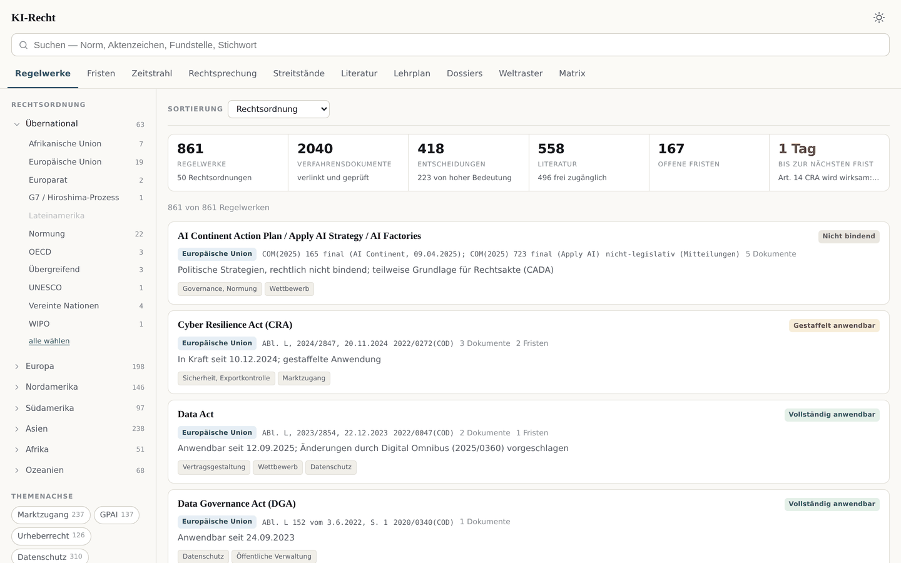
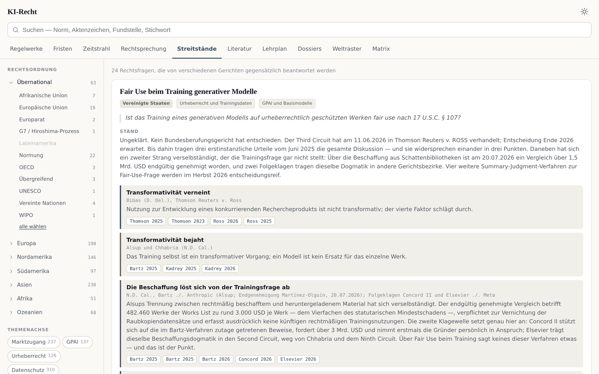
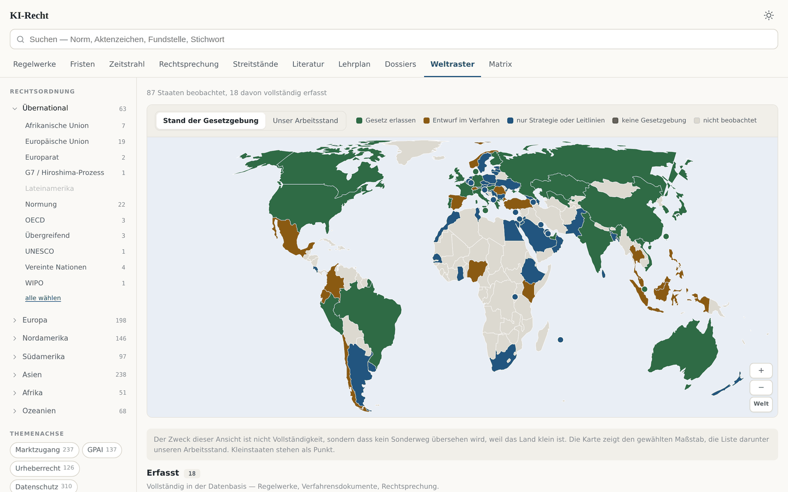
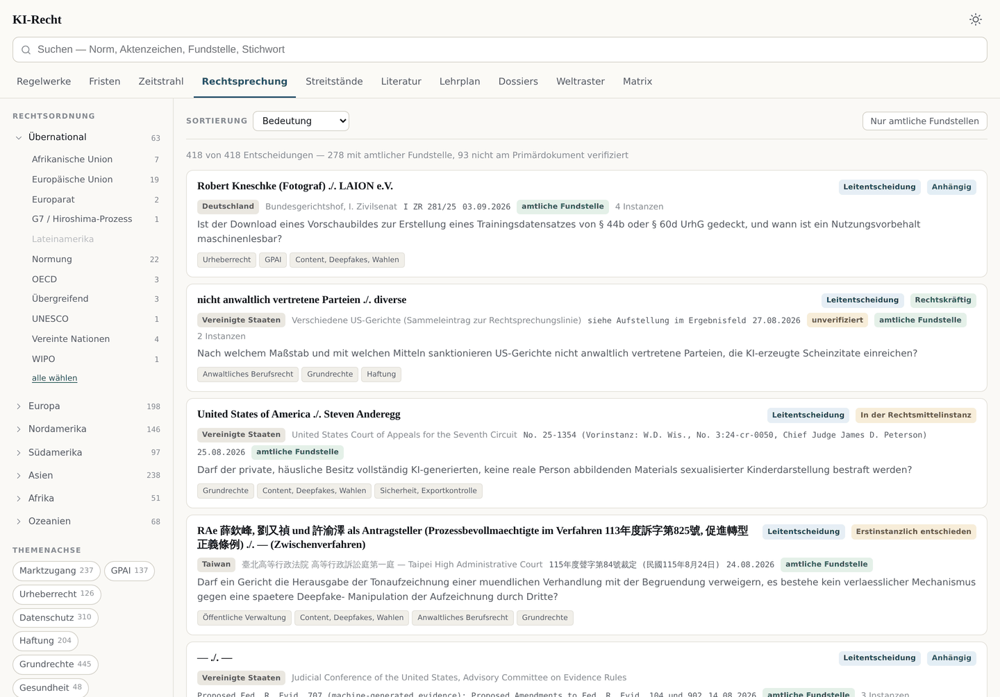
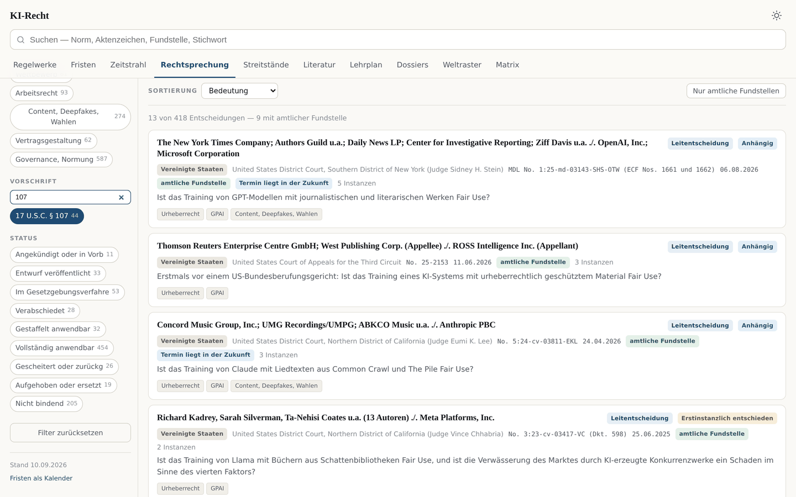
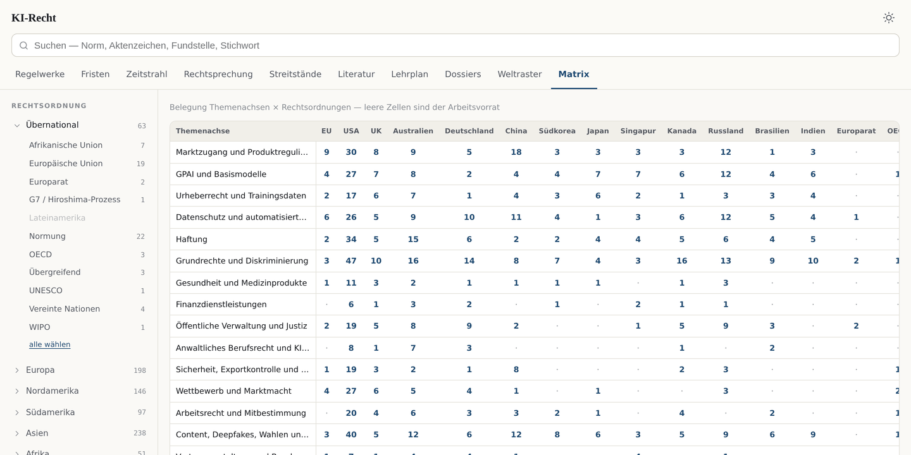

# Internationales KI-Recht — Datenbasis, App und Tracker

*English version: [README.md](README.md)*

Eine strukturierte Datenbasis zur KI-Regulierung in 50 Rechtsordnungen, eine
daraus erzeugte durchsuchbare App und ein Beobachtungsdienst, der zweimal
täglich amtliche Quellen abruft.

Nicht eine Sammlung von Links, sondern ein Modell des Rechtsgebiets: Gesetze,
die einzelnen Vorschriften darin, Entscheidungen, die daran hängen, Literatur,
die sie kommentiert — und quer über allem die ungeklärten Rechtsfragen, an
denen sich das Material sortiert.

Die App wird aus der Datenbasis erzeugt (`python3 build/build.py`, dann
`app/index.html` über einen lokalen Server öffnen) und kann deshalb nicht
hinter den Daten zurückbleiben.

## Die App



Die Startansicht: 861 Regelwerke, filterbar nach Rechtsordnung (geordnet
übernational, dann nach Kontinent), nach Themenachse und nach Status.



Ein Streitstand — die ungeklärte Frage, die einander widersprechenden
Positionen, die Gerichte, die sie vertreten, und die Entscheidungen, auf
denen jede Position ruht. Dafür ist der ganze übrige Aufbau da.



Das Weltraster: 87 Staaten, wahlweise nach Stand der Gesetzgebung oder nach
dem Arbeitsstand dieser Datenbasis. Kleinstaaten stehen als Punkt, damit kein
Sonderweg übersehen wird, weil das Land klein ist.



Die Rechtsprechung. Jeder Eintrag sagt, ob er auf einem amtlichen Volltext
ruht und ob er am Primärdokument geprüft ist — 418 Entscheidungen, 257 mit
amtlicher Fundstelle, 50 nur über eine Rechtsdatenbank, 111 ohne Volltext.



Die Normebene: der Filter auf eine einzelne Vorschrift — hier 17 U.S.C. § 107
— liefert jede Entscheidung, die an ihr hängt, über alle Rechtsordnungen
hinweg. Das ist der Zugriff, den eine Gesetzesliste nicht gibt.



Die Belegungsmatrix. Leere Zellen sind kein Versäumnis, sondern der
Arbeitsvorrat.

## Bestand

| | |
|---|---|
| Regelwerke | **861** aus 50 Rechtsordnungen |
| Verfahrensdokumente | **2040**, 71 % mit amtlicher Adresse, 51 % am Dokument geprüft |
| Einzelvorschriften | **2068**, davon 665 mit Wortlaut und amtlichem Link |
| Entscheidungen | **418**, 61 % mit amtlichem Volltext |
| Streitstände | **24** mit 194 Positionen |
| Literatur | **558** Titel |
| Fristen | **295** mit Vorwarnung und Kalenderausgabe |
| Weltraster | **87** Staaten gesichtet |

## Die sechs Ebenen

**Regelwerk** — Gesetz, Verordnung oder Entwurf mit Verfahrensstand,
Inkrafttreten (bei 606 von 861 am amtlichen Text geprüft), gestaffelten
Anwendungsdaten und Verfahrensdokumenten.

**Vorschrift** — die einzelne Norm als eigenständiges Objekt. Das ermöglicht
den Zugriff „alles zu Art. 50 KI-VO" oder „alles zu § 44b UrhG" über alle
Rechtsordnungen hinweg. 665 Vorschriften führen Wortlaut und amtlichen Link;
die übrigen sind Verweise zum Verknüpfen und Filtern.

**Entscheidung** — Rubrum, Aktenzeichen, Sachverhalt, Tenor, tragende Gründe
und Fundstelle. Was nicht am Dokument geprüft ist, trägt einen Prüfvermerk,
der sagt, was fehlt.

**Streitstand** — die ungeklärte Rechtsfrage mit den einander
widersprechenden Positionen, den Gerichten, die sie vertreten, den tragenden
Argumenten und einer Auflösungsprognose.

**Literatur** — mit Kernthese, Bewertung und Verknüpfung zu den Streitständen.

**Frist** — Stichtage mit amtlicher Fundstelle und Vorwarnung.

## Die drei Regeln, an denen alles hängt

1. **`volltext_url` nur bei amtlichem Volltext.** Presse, Kanzleiseiten und
   Trackerportale gehören in `sekundaerquelle_url`.
2. **Lieber eine Lücke als eine erfundene Fundstelle.** Was nicht geprüft ist,
   trägt `verifiziert: false` und einen Prüfvermerk, der sagt, warum.
   1850 offene Punkte stehen ausdrücklich benannt in den Einträgen.
3. **Der Streitstand ist der Ertrag, nicht die Entscheidung.**

## Aufbau

```
schema/     Taxonomie, Datenmodell, Validator
data/       Die Datenbasis — hier wird gepflegt
build/      Erzeugt App-Daten, Suchindex und Kalenderfeed aus data/
app/        Die Oberfläche
tracker/    Quellenregister, Abruf, Fristenwarnung, Benachrichtigung
docs/       Überblick über Anspruch und Grenzen, Zugangswege zu den Quellen
```

## Ablauf

```bash
python3 schema/validate.py      # Vokabular, ids, tote Verweise, Schemaabgleich
python3 build/fremdumlaut.py    # verfälschte Umlaute in beide Sprachrichtungen
python3 build/quellenart.py     # Belastbarkeit jeder Fundstelle einstufen
python3 build/build.py          # app/data.json und app/fristen.ics
python3 build/guete.py          # amtliche Absicherung je Bestandteil
python3 build/abdeckung.py      # Reifegrad je Rechtsordnung
```

## Prüfwerkzeuge

Die Datenbasis prüft sich selbst. `validate.py` kontrolliert kontrolliertes
Vokabular, doppelte und tote ids, referenzierte aber nicht erfasste
Regelwerke — und meldet Felder, die in den Daten auftauchen, aber nicht im
Schema stehen. Diese Prüfung entstand, nachdem ein unbemerkter Feldnamen-Drift
sieben Auflösungsprognosen unsichtbar gemacht hatte.

`fremdumlaut.py` findet fremdsprachige Wörter, die eine frühere
Umlaut-Heuristik verfälscht hat — „Doe" zu „Dö", „Due" zu „Dü", „Caesars" zu
„Cäsars" — und prüft gegen deutsches und englisches Wörterbuch in beide
Richtungen.

`quellenart.py` stuft jeden Verweis als amtlich, Datenbank, sekundär oder
fehlend ein und macht sichtbar, wo eine belastbare Fundstelle fehlt.

## Beobachtung

`tracker/watch.py` ruft die in `tracker/quellen.yaml` verzeichneten Quellen
ab, `literatur.py` durchsucht Publikationsprofile, `fristen.py` warnt vor
ablaufenden Stichtagen. Läuft über GitHub Actions zweimal täglich.
`pruefe_quellen.py` prüft monatlich, welche Quelle stillschweigend gestorben
ist.

## Stand

Der Bestand ist in Arbeit und sagt selbst, wo er dünn ist: 111 Entscheidungen
ohne belastbare Fundstelle, 255 Regelwerke ohne geprüftes Inkrafttreten, und
eine laufende Beobachtung nur für zwölf der 50 erfassten Rechtsordnungen. Die
gemessene Fehlerquote bei der Prüfung von Inkrafttretensdaten lag bei 17 % —
was ungeprüft ist, ist mit dieser Quote zu lesen.

`docs/UEBERBLICK.md` erklärt Anspruch und Grenzen im Einzelnen.
